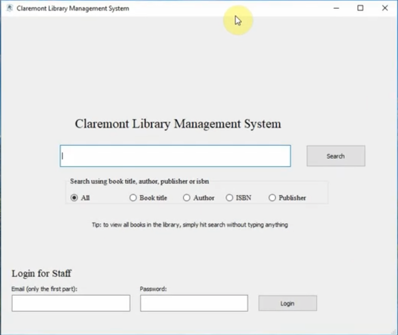
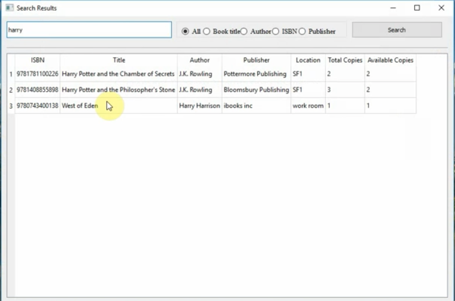
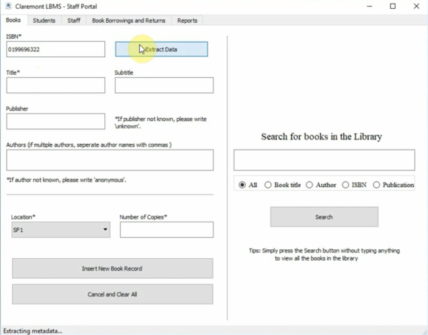
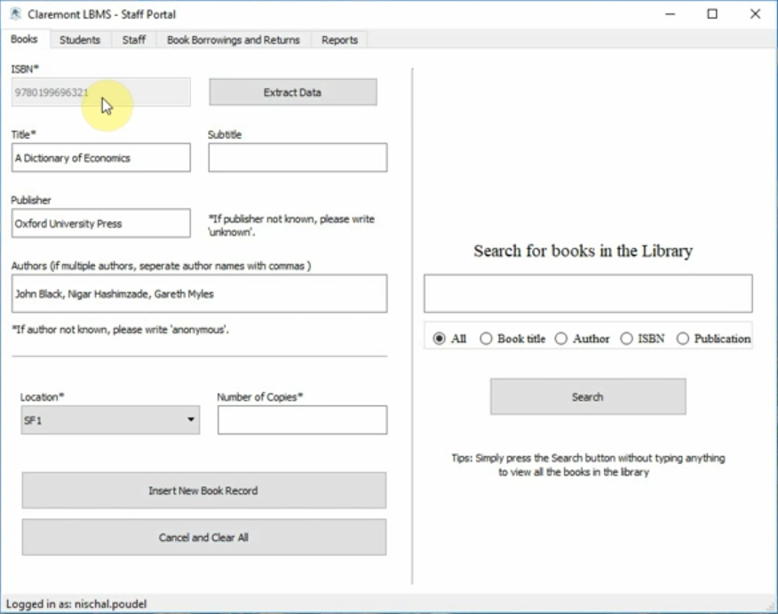
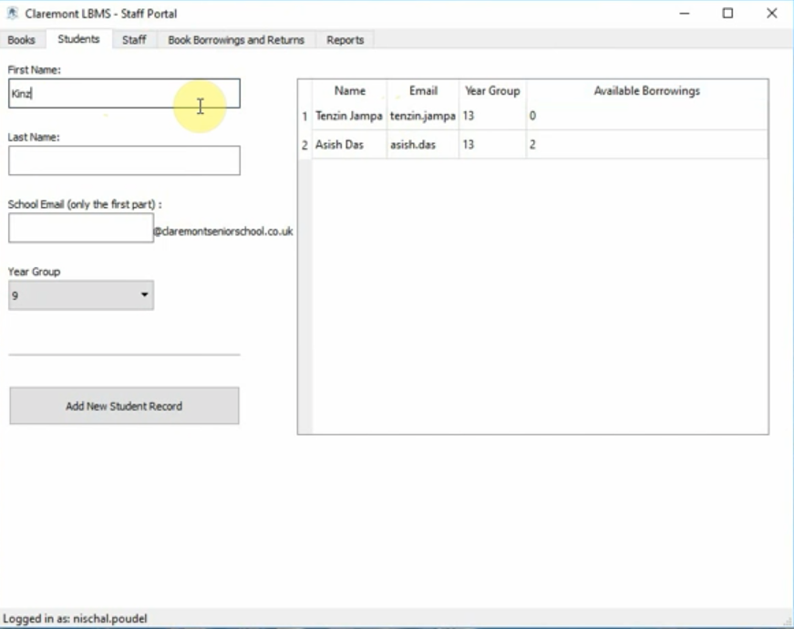
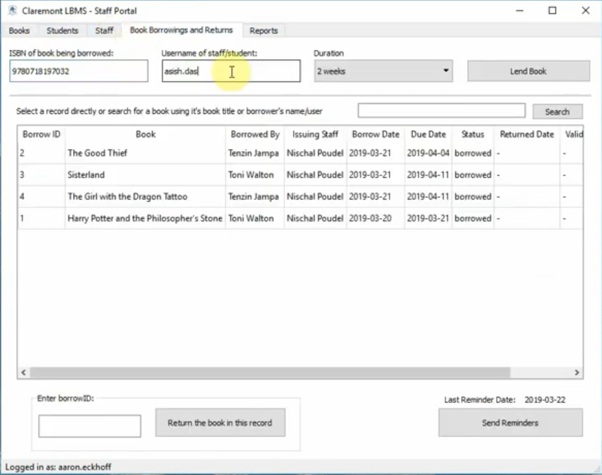

# Claremont Library Management System

Library Management System for Claremont Senior School.

This was the final project for my Alevel Computer Science.

## Tools Used

Python, PyQt4, MySQL, Google Books API

## Features

Users (Students) can search for books, Staffs can issue book borrows and returns,
add new books, new student records, as well as send automated email reminders about book returns.

Google Books API is used to autofill information about books (while adding them to the
library) based on their ISBN.

### Login Window

### Search Window

### Books Tab

(using tab view of PyQt)

### Extracting Books data using Goolge Books API

(using tab view of PyQt)

### Student tab

### Book Borrowings and Returns tab

